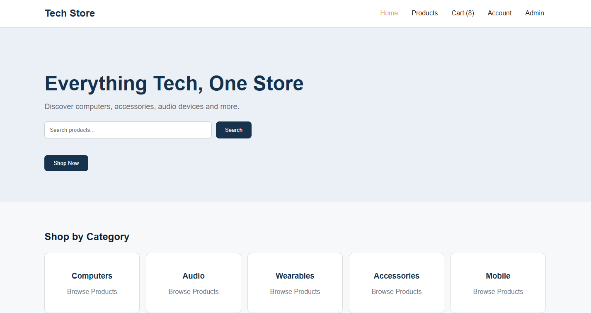
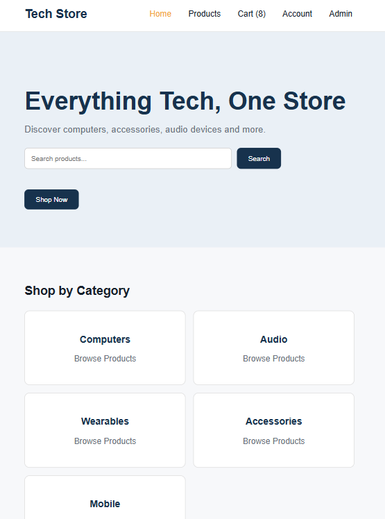
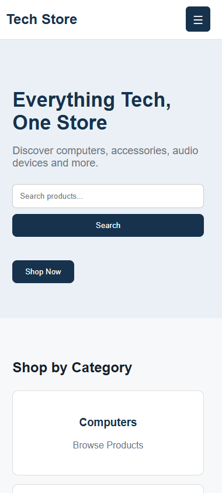
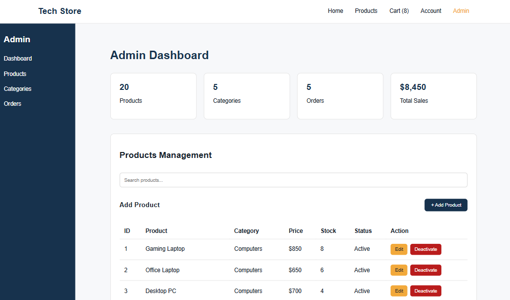
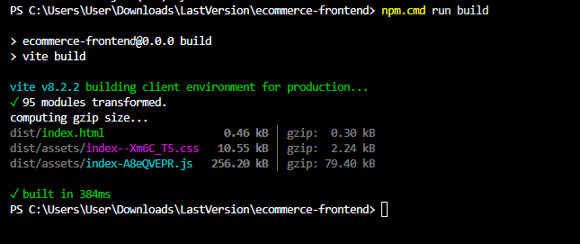

# Tech Store - React E-Commerce Frontend

## Project Description

Tech Store is a responsive e-commerce frontend application built using React and Vite.

The project simulates a complete online technology store with customer pages, shopping cart, checkout, authentication, profile management, and an Admin Dashboard.

This version uses local Mock Data only and is not connected to the REST API or Neon database yet. The real API integration will be implemented in a later stage.

---

## Technologies Used

- React
- Vite
- React Router
- JavaScript
- HTML
- CSS
- Context API
- LocalStorage

---

## Installation

Install the project dependencies:

```bash
npm install
```

Run the development server:

```bash
npm run dev
```

Build the project for production:

```bash
npm run build
```

The production build is generated inside:

```text
dist/
```

---

## Project Structure

```text
src/
├── assets/
├── components/
│   ├── cart/
│   ├── common/
│   ├── forms/
│   ├── layout/
│   │   ├── Navbar.jsx
│   │   ├── Footer.jsx
│   │   └── AdminSidebar.jsx
│   └── products/
│       ├── ProductCard.jsx
│       └── CategoryCard.jsx
├── context/
│   ├── AuthContext.jsx
│   └── CartContext.jsx
├── data/
│   ├── products.js
│   ├── orders.js
│   └── users.js
├── hooks/
├── pages/
│   ├── Home.jsx
│   ├── Products.jsx
│   ├── ProductDetails.jsx
│   ├── Cart.jsx
│   ├── Checkout.jsx
│   ├── Login.jsx
│   ├── Register.jsx
│   ├── Profile.jsx
│   ├── Admin.jsx
│   └── NotFound.jsx
├── styles/
├── utils/
├── App.jsx
├── index.css
└── main.jsx
```

---

## Main Routes

| Route | Page |
|---|---|
| `/` | Home |
| `/products` | Products |
| `/products/:id` | Product Details |
| `/cart` | Shopping Cart |
| `/checkout` | Checkout |
| `/login` | Login |
| `/register` | Register |
| `/profile` | User Profile |
| `/admin` | Admin Dashboard |
| `*` | 404 Page |

---

## Main Features

### Home Page

- Hero section
- Product search
- Product categories
- Featured products
- Latest products
- Promotional banner

### Products

- 20 mock products
- 5 product categories
- Product search
- Category filtering
- Price filtering
- Stock filtering
- Sorting by name and price
- Clear filters
- Load More
- No Results state

### Product Details

- Product information
- Product image
- Price
- Category
- Stock status
- Limited Stock state
- Out of Stock state
- Quantity selection
- Add to Cart
- Similar products

### Shopping Cart

- Add products
- Update quantity
- Prevent quantity above available stock
- Remove product with confirmation
- Calculate total price
- Cart item counter in Navbar
- Cart saved using LocalStorage
- Empty Cart state

### Checkout

- Customer name
- Phone
- Address
- City
- Payment method
- Form validation
- Order summary
- Generated mock order number
- Cart cleared after successful order

### Authentication

The project uses local demo accounts.

#### Customer Account

```text
Email: customer@example.com
Password: customer123
```

#### Admin Account

```text
Email: admin@example.com
Password: admin123
```

Login includes:

- Email and password validation
- Show / Hide password
- Loading state
- LocalStorage session
- Role-based access

### User Profile

- Display account information
- Edit name and phone
- Change password simulation
- Five previous mock orders
- Logout confirmation

### Admin Dashboard

Admin users can access:

- Dashboard statistics
- Products Management
- Search products
- Add product
- Edit product
- Activate / Deactivate product
- Categories Management
- Add category
- Orders Management
- Change order status
- Admin Sidebar navigation

Customer accounts are prevented from accessing the Admin Dashboard.

---

## Responsive Design

The interface supports:

- Desktop
- Tablet
- Mobile

The layout includes:

- Responsive product grids
- Responsive forms
- Mobile Navbar menu
- Responsive Admin Dashboard
- Responsive tables and content sections

Recommended test sizes:

```text
Desktop: 1440px
Tablet: 768px
Mobile: 390px
```

---

## UI States

The project includes:

- Loading
- Error
- Empty Cart
- No Search Results
- Success messages
- Out of Stock
- Limited Stock
- Disabled buttons
- Invalid Form
- Unauthorized
- 404 Page

---

## Mock Data

The application currently uses local data stored inside:

```text
src/data/
```

The project is intentionally not connected to the REST API or Neon database in this stage.

The backend integration will be implemented later.

---

## Build Status

Production build tested successfully using:

```bash
npm run build
```

Result:

```text
✓ built successfully
```

---

## GitHub

[GitHub Repository](https://github.com/AyatAlhussien/tech-store-react)

## Live Preview

[View Live Website](https://heroic-brioche-dad08d.netlify.app)

---

## Screenshots

### Desktop


### Tablet


### Mobile


### Admin Dashboard


### Build Success


---

## Notes

- No real passwords or secret keys are used.
- No API or Neon connection is used in this frontend stage.
- All products, users, categories, and orders are Mock Data.
- The project uses reusable React Components.
- Cart data is stored using LocalStorage.
- Customer and Admin roles are simulated locally.
